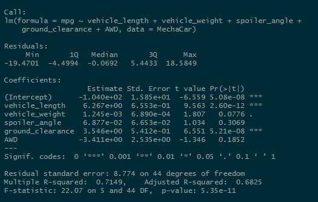

# MechaCar Statistical Analysis

## Resources
- Data: MechaCar_mpg.csv, Suspension_Coil.csv
- Software: Rstudio v1.4.1717, R-4.1.1
- Packages: dplyr, ggplot2, tidyverse

## Linear Regression to Predict MPG
BEFORE I began this analysis, I chose a p-value of 0.05 as my tolerance level to test null and alternative hypotheses.  After running the multiple line regression, I got the following summary statistics:

- *Which variables/coefficients provided a non-random amount of variance to the mpg values in the dataset?*

The p-values for **vehicle length** and **ground clearance** were below the p = 0.05 threshold to reject the null hypothesis in favor of the alternative, and delcare both of those attributes statistically significant to the mpg value of the MechaCar vehicle.

- *Is the slope of the linear model considered to be zero? Why or why not?*

The p-value: 5.35 &times; 10-11 for the linear model is well below the pre-determined significance level of p = 0.05 to reject the null hypothesis that states the slope of the linear model is zero in favor of the alternative hypothesis that the **slope of this linear model is not zero**.

- *Does this linear model predict mpg of MechaCar prototypes effectively? Why or why not?*

This linear model has an R2-value of 0.7149 which indicates that approximately 71% of the data can be modeled by the linear regression formula:

>mpg = 6.267&times;(vehicle_length) + 1.245&times;10-3&times;(vehicle_weight) + 6.877&times;10-2&times;(spoiler_angle) + 3.546&times;(ground_clearance) -3.411&times;AWD - 1.04&times;102

For our purposes, the **multiple regression model does predict mpg effectively**.

## Suspension Coil Summary Statistics

## T-Test Results on Manufacturing Lots

## Study Design: MechaCar vs. Competition
