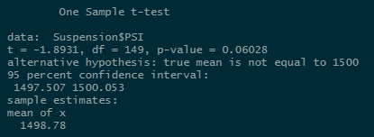
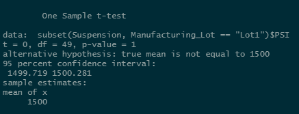
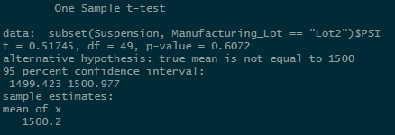

# MechaCar Statistical Analysis

## Resources
- Data: MechaCar_mpg.csv, Suspension_Coil.csv
- Software: Rstudio v1.4.1717, R-4.1.1
- Packages: dplyr, ggplot2, tidyverse

## Linear Regression to Predict MPG
BEFORE I began this analysis, I chose a p-value of 0.05 as my tolerance level to test null and alternative hypotheses.  After running the multiple line regression, I got the following summary statistics:

- *Which variables/coefficients provided a non-random amount of variance to the mpg values in the dataset?*

The p-values for **vehicle length** and **ground clearance** were below the p = 0.05 threshold to reject the null hypothesis in favor of the alternative, and delcare both of those attributes statistically significant to the mpg value of the MechaCar vehicle.

- *Is the slope of the linear model considered to be zero? Why or why not?*

The p-value: 5.35 &times; 10-11 for the linear model is well below the pre-determined significance level of p = 0.05 to reject the null hypothesis that states the slope of the linear model is zero in favor of the alternative hypothesis that the **slope of this linear model is not zero**.

- *Does this linear model predict mpg of MechaCar prototypes effectively? Why or why not?*

This linear model has an R2-value of 0.7149 which indicates that approximately 71% of the data can be modeled by the linear regression formula:

>mpg = 6.267&times;(vehicle_length) + 1.245&times;10-3&times;(vehicle_weight) + 6.877&times;10-2&times;(spoiler_angle) + 3.546&times;(ground_clearance) -3.411&times;AWD - 1.04&times;102

For our purposes, the **multiple regression model does predict mpg effectively**.

## Summary Statistics on Suspension Coils
Weight capacities of multiple suspension coils were tested to determine if the manufacturing process is consistent across production lots.  The design specifications for the MechaCar suspension coils dictate that the variance of the suspension coils must not exceed 100 pounds per square inch. 

Looking at the summary statistics of all three lots above, the PSI variance is 62.29356 which is well within the specification limit of 100 PSI.

However, by looking at the data grouped by individual lot number above, it can be readily seen that the variance in lot #3 is over 170, which is well above the limit of 100 PSI.

## T-Test Results on Suspension Coils

The first t-test was performed to determine if the PSI across all manufacturing lots is statistically different from the population mean of 1500.  The p-value is 0.06028, therefore we reject the alternative hypothesis in favor of the null hypothesis and conclude that there is **no** statistical difference in means.

### Lot 1 t-test

Next we tested Lot #1 individually against the population mean and found that the p-value is 1, so again we reject the alternative hypothesis in favor of the null hypothesis and conclude that there is **no statistical difference in means**.

### Lot 2 t-test

As shown above, the t-test on Lot #2 has a p-value of 0.6072, so once more we reject the alternative hypothesis in favor of the null hypothesis and conclude that there is **no statistical difference in means**.

### Lot 3 t-test

As shown above, the t-test on Lot #3 has a p-value of 0.04168, so in this case we reject the null hypothesis, and conclude that the mean PSI for this dataset **is statistically different than the population mean**.

## Study Design: MechaCar vs. Competition
